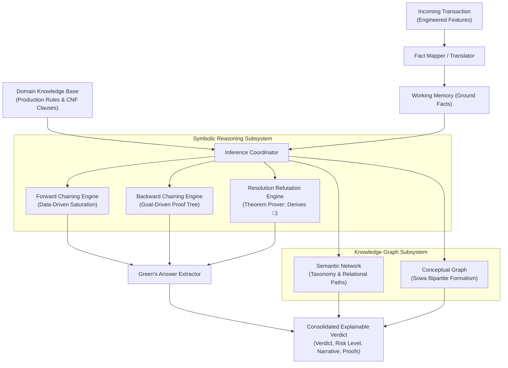

# Rule-Based Expert System & Knowledge Representation — FraudSentinel

## Executive Summary
This document provides the theoretical foundation, architectural specification, and execution examples for the **Rule-Based Expert System** module in **FraudSentinel**. Designed in alignment with classical Artificial Intelligence and Knowledge Representation & Reasoning (KR&R) curricula, this module delivers transparent, deterministic, and auditable fraud analysis through eight foundational symbolic reasoning components.

---

## 1. System Architecture & High-Level Flow



---

## 2. Component Specifications & Technical Details

### Component 1: Knowledge Base (`KnowledgeBase`)
The Knowledge Base consists of domain facts, predicates, and formal production rules expressed as Horn clauses:
$$\bigwedge_{i=1}^{n} A_i \implies C$$
where each antecedent $A_i$ is a required fact and $C$ is the derived consequent.

#### Rule Base Catalog
1. **`R1_CompoundCriticalAnomaly` (Priority 90)**:
   $$\text{high\_amount} \land \text{night\_transaction} \land \text{location\_change} \implies \text{fraud}$$
2. **`R2_AccountTakeoverPattern` (Priority 80)**:
   $$\text{device\_change} \land \text{location\_change} \land \text{rapid\_velocity} \implies \text{suspicious\_account\_takeover}$$
3. **`R3_AccountTakeoverEscalation` (Priority 85)**:
   $$\text{suspicious\_account\_takeover} \land \text{high\_amount} \implies \text{fraud}$$
4. **`R4_RapidDrainPattern` (Priority 75)**:
   $$\text{rapid\_velocity} \land \text{max\_amount\_deviation} \implies \text{rapid\_drain\_attack}$$
5. **`R5_RapidDrainEscalation` (Priority 85)**:
   $$\text{rapid\_drain\_attack} \land \text{night\_transaction} \implies \text{fraud}$$
6. **`R6_UnauthorizedDeviceShift` (Priority 70)**:
   $$\text{device\_change} \land \text{max\_amount\_deviation} \land \text{high\_amount} \implies \text{suspicious\_unauthorized\_access}$$
7. **`R7_UnauthorizedAccessEscalation` (Priority 80)**:
   $$\text{suspicious\_unauthorized\_access} \land \text{rapid\_velocity} \implies \text{fraud}$$
8. **`R8_StandardLegitimateBaseline` (Priority 20)**:
   $$\text{regular\_amount} \land \text{regular\_device} \land \text{regular\_location} \land \text{regular\_hours} \implies \text{legitimate}$$
9. **`R9_LowVelocityDaytime` (Priority 15)**:
   $$\text{normal\_velocity} \land \text{regular\_hours} \implies \text{low\_risk\_behavior}$$
10. **`R10_LowRiskClearance` (Priority 25)**:
   $$\text{low\_risk\_behavior} \land \text{regular\_amount} \implies \text{legitimate}$$

---

### Component 2: Forward Chaining Engine (`ForwardChainingEngine`)
A data-driven inference algorithm operating on Working Memory:
1. **Initialize**: Load initial ground facts asserted from transaction features.
2. **Match**: Identify all rules whose antecedents are satisfied by the current facts.
3. **Conflict Resolution**: Sort applicable rules by priority (descending) and lexicographical name.
4. **Fire**: Add the selected rule's consequent to Working Memory.
5. **Cycle**: Repeat until fixed-point saturation (no new rules can fire) or conclusion.

#### Example Step Trace (Suspicious Transaction)
```text
Step 1: Applied R1_CompoundCriticalAnomaly [high_amount, location_change, night_transaction] 
        => Derived fraud.
Step 2: Applied R2_AccountTakeoverPattern [device_change, location_change, rapid_velocity] 
        => Derived suspicious_account_takeover.
Step 3: Applied R3_AccountTakeoverEscalation [high_amount, suspicious_account_takeover] 
        => Derived fraud.
```

---

### Component 3: Backward Chaining Engine (`BackwardChainingEngine`)
A goal-driven recursive search algorithm that proves or refutes a candidate hypothesis:
- **Target Goal**: $\text{fraud}$
- **Base Case**: Goal exists in known ground facts.
- **Recursive Step**: For rules concluding the goal, recursively prove all antecedents as sub-goals.
- **Cycle Detection**: Tracks visited goals along the current branch to avoid infinite loops.

#### Example Proof Tree
```text
└── fraud ✓ [PROVEN] (Rule: R1_CompoundCriticalAnomaly)
    ├── high_amount ✓ [PROVEN] (Fact)
    ├── night_transaction ✓ [PROVEN] (Fact)
    └── location_change ✓ [PROVEN] (Fact)
```

---

### Component 4: Green's Answer Extraction (`AnswerExtractor`)
Implements Green's classical Answer Extraction technique to synthesize the formal deduction into concrete operational answers for fraud analysts:
- **Variable Bindings**: Maps transaction variables to real values:
  `{transaction_id: 'TX_FRAUD_909', customer_id: 'CUST_808', amount: 7500.00, hour: 3, location_change: True, device_change: True, velocity_1h: 4}`
- **Supporting Evidence**: Minimal set of ground facts justifying the conclusion.
- **Audit Narrative**:
  > *"Transaction TX_FRAUD_909 for Customer CUST_808 has been classified as FRAUD. The inference engine triggered: [R1_CompoundCriticalAnomaly -> R2_AccountTakeoverPattern -> R3_AccountTakeoverEscalation]. Key risk indicators include: device_change, high_amount, location_change, night_transaction, rapid_velocity."*

---

### Component 5: Semantic Network (`SemanticNetwork`)
A graph-based knowledge representation modeling entities, classifications, and relational arcs:
- **Nodes**:
  - Entity instances: `TX_FRAUD_909`, `CUST_808`, `Device:POS`, `Location:Texas`
  - Taxonomic classes: `Class:Transaction`, `Class:FinancialCrime`, `Class:AccountTakeover`
  - Risk factors: `Risk:HighAmount`, `Risk:NightHours`, `Risk:DeviceAnomaly`, `Risk:LocationAnomaly`
  - Verdict node: `Conclusion:FraudAlert`
- **Edges**:
  - `instance_of`, `performed_by`, `used_device`, `occurred_at`, `has_risk_indicator`, `indicates_risk`, `triggers`
- **Path Traversal**: Discovers causal paths connecting transaction instances to risk categories:
  `TX_FRAUD_909 -> (has_risk_indicator) -> Risk:DeviceAnomaly -> (indicates_risk) -> Class:AccountTakeover -> (triggers) -> Conclusion:FraudAlert`

---

### Component 6: Conceptual Graph (`ConceptualGraph`)
Based on John F. Sowa's (1984) Conceptual Graph formalism using a bipartite structure:
1. **Concepts**: `[ConceptType: Referent]`
2. **Conceptual Relations**: `(relation_name)`

#### Sowa Linear Notation Output
```text
[CUSTOMER: CUST_808] -> (initiates) -> [TRANSACTION: TX_FRAUD_909]
[TRANSACTION: TX_FRAUD_909] -> (has_amount) -> [MONETARY_AMOUNT: $7,500.00]
[TRANSACTION: TX_FRAUD_909] -> (utilizes_device) -> [DEVICE: POS]
[TRANSACTION: TX_FRAUD_909] -> (originates_from) -> [LOCATION: Texas]
[TRANSACTION: TX_FRAUD_909] -> (executed_at) -> [TIME_OF_DAY: 03:00]
[MONETARY_AMOUNT: $7,500.00] -> (evaluated_as) -> [RISK_ASSESSMENT: HighFinancialExposure]
[TIME_OF_DAY: 03:00] -> (violates_normalcy) -> [ANOMALY: NocturnalWindow]
[DEVICE: POS] -> (flags_irregularity) -> [ANOMALY: UnrecognizedHardware]
[LOCATION: Texas] -> (flags_irregularity) -> [ANOMALY: GeographicalDiscrepancy]
[TRANSACTION: TX_FRAUD_909] -> (triggers_verdict) -> [VERDICT: FRAUD_ALERT]
```

---

### Component 7: Resolution Refutation Engine (`ResolutionRefutationEngine`)
An automated theorem prover using J. Alan Robinson's (1965) Resolution Principle on Conjunctive Normal Form (CNF) clauses:
1. **CNF Conversion of Rules**:
   Rule $(A_1 \land A_2 \land A_3 \implies C)$ converts to:
   $$\neg A_1 \lor \neg A_2 \lor \neg A_3 \lor C$$
2. **Unit Fact Clauses**:
   Each ground fact $F_i$ enters the clause set as a unit clause $\{F_i\}$.
3. **Negated Goal**:
   To prove hypothesis $Fraud$, add the negated goal:
   $$\neg Fraud$$
4. **Resolution Rule**:
   Given clauses $(C_1 \lor P)$ and $(C_2 \lor \neg P)$, derive the resolvent $(C_1 \lor C_2)$.
5. **Contradiction**:
   Resolving against unit facts cascades until the empty clause $\square$ is derived, proving $Fraud$ by contradiction.

#### Example Resolution Trace
```text
Resolution 1:
  Clause 1: ~high_amount ∨ ~location_change ∨ ~night_transaction ∨ fraud
  Clause 2: ~fraud (Negated Goal)
  Resolved on: fraud
  Resolvent: ~high_amount ∨ ~location_change ∨ ~night_transaction

Resolution 2:
  Clause 1: ~high_amount ∨ ~location_change ∨ ~night_transaction
  Clause 2: high_amount (Ground Fact)
  Resolved on: high_amount
  Resolvent: ~location_change ∨ ~night_transaction

Resolution 3:
  Clause 1: ~location_change ∨ ~night_transaction
  Clause 2: location_change (Ground Fact)
  Resolved on: location_change
  Resolvent: ~night_transaction

Resolution 4:
  Clause 1: ~night_transaction
  Clause 2: night_transaction (Ground Fact)
  Resolved on: night_transaction
  Resolvent: □ (Empty Clause / Contradiction)
  Result: Hypothesis 'fraud' is MATHEMATICALLY PROVEN!
```

---

### Component 8: Master Coordinator (`FraudExpertSystem`)
The master class `FraudExpertSystem` orchestrates all seven engines and produces an explainable, auditable JSON payload for analyst dashboards and downstream fraud operations.

---

## 3. Verification & Test Suite Summary

The module was verified via an 11-test automated suite in [test_expert_system.py](file:///c:/Users/ishit/FraudSentinel/tests/test_reasoning/test_expert_system.py):

| Test Case | Scope | Expected Outcome | Status |
| :--- | :--- | :--- | :---: |
| `test_expert_system_normal_transaction` | Full System Integration | Cleared as `LEGITIMATE`, risk `LOW`, refutation negative | **PASSED** |
| `test_expert_system_suspicious_transaction` | Full System Integration | Flagged as `FRAUD`, risk `CRITICAL`, refutation derives $\square$ | **PASSED** |
| `test_expert_system_rapid_drain_attack` | Velocity + Deviation pattern | Flags `R4_RapidDrainPattern` and `R5_RapidDrainEscalation` | **PASSED** |
| `test_expert_system_partial_anomaly` | Isolated High Amount | No compound trigger, not flagged as fraud | **PASSED** |
| `test_knowledge_base_rule_matching` | Knowledge Base | Rule condition matching and indexing | **PASSED** |
| `test_forward_chaining_priority` | Forward Chaining | Conflict resolution prioritizes highest priority rules | **PASSED** |
| `test_backward_chaining_cycle_prevention` | Backward Chaining | Prevents circular loop and reports cycle detection | **PASSED** |
| `test_answer_extraction_structure` | Answer Extraction | Extracts variable bindings and analyst narrative | **PASSED** |
| `test_semantic_network_graph_paths` | Semantic Network | Directed path search identifies causal risk links | **PASSED** |
| `test_conceptual_graph_linear_form` | Conceptual Graph | Verifies bipartite structure and Sowa linear notation | **PASSED** |
| `test_resolution_refutation_simple_modus_ponens` | Resolution Engine | Derives $\square$ on propositional Modus Ponens | **PASSED** |

Execution command:
```powershell
.venv\Scripts\python -m unittest tests/test_reasoning/test_expert_system.py -v
```
All 11 tests executed cleanly in **0.016s** with zero external dependencies.
