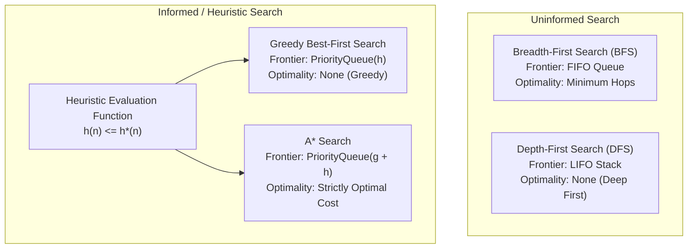

# Academic & Technical Report: Graph Search Algorithms for Fraud Investigation

This report presents the theoretical principles, algorithmic complexity, heuristic formalizations, and empirical benchmark evaluations of **Module II Search Algorithms** in **FraudSentinel** (`backend/ml/search/`).

---

## 1. Problem Formulation in Financial Crime & AML

In financial forensics and Anti-Money Laundering (AML), criminal syndicates evade direct transaction monitoring by distributing stolen funds across multiple hops—a process known as **structuring (smurfing)** and **layering**:
- Stolen funds originate from a **Victim Account** ($S_0$).
- Funds are dispersed through high-velocity **Smurfing Conduits**.
- Aggregated by **Money Mule Accounts**.
- Obfuscated through multiple **Shell Company Layers**.
- Liquidated at **Crypto Off-ramps** or withdrawn at centralized **Syndicate Hubs** ($S_G$).

### State Space Representation

A financial investigation network is modeled as a weighted directed graph $\mathcal{G} = (\mathcal{V}, \mathcal{E}, c)$:
- **State Space $\mathcal{V}$**: Bank accounts, customer entities, digital devices, and mule wallets.
- **Actions / Edges $\mathcal{E}$**: Fund transfers, shared hardware fingerprints, or co-ownership links.
- **Path Cost $c(u, v) \ge 0$**: Investigative resistance, transaction friction, or cumulative audit cost.
- **Goal Test $\text{IsGoal}(s)$**: Whether node $s$ is an identified laundering off-ramp or syndicate collection hub.
- **Objective**: Discover the fund dissipation trail connecting victims to fraud hubs, comparing the tradeoffs between hop distance, cumulative investigative cost, and computational search efficiency.

---

## 2. Theoretical Overview of the 4 Graph Search Algorithms

### 1. Breadth-First Search (BFS)
- **Frontier Structure**: First-In, First-Out (FIFO) queue (`collections.deque`).
- **Expansion Strategy**: Explores nodes level-by-level in order of their hop distance from the root.
- **Optimality**: **Hop-Optimal**. Guarantees the path with the minimum number of edges/hops. However, it ignores edge weights $c(u, v)$, frequently choosing high-cost direct conduits over cheaper multi-hop routes.
- **Time Complexity**: $\mathcal{O}(b^d)$, where $b$ is the branching factor and $d$ is the goal depth.
- **Space Complexity**: $\mathcal{O}(b^d)$ (all frontier nodes at depth $d$ are stored in memory).

### 2. Depth-First Search (DFS)
- **Frontier Structure**: Last-In, First-Out (LIFO) stack (`list.pop()`).
- **Expansion Strategy**: Pursues paths aggressively to maximum depth before backtracking upon reaching dead ends. Employs a visited closed set to prevent infinite cycles in loopy banking graphs.
- **Optimality**: **Non-optimal**. Path cost and hop count depend entirely on the arbitrary tie-breaking order of adjacent edges.
- **Time Complexity**: $\mathcal{O}(b^m)$, where $m$ is the maximum graph depth.
- **Space Complexity**: $\mathcal{O}(b \cdot m)$ (only maintains the active path and unexplored siblings).

### 3. Greedy Best-First Search
- **Frontier Structure**: Priority Queue ordered purely by heuristic evaluation function:
  $$f(n) = h(n)$$
- **Expansion Strategy**: Selects the node estimated to be closest to the goal based on geometric or risk-informed heuristics.
- **Optimality**: **Non-optimal**. Highly susceptible to local false trails or high-cost edges if the heuristic under-represents edge friction.
- **Time Complexity**: $\mathcal{O}(b^m)$ in worst-case; near $\mathcal{O}(b \cdot d)$ with high-quality heuristics.
- **Space Complexity**: $\mathcal{O}(b^m)$ (retains all generated nodes in open/closed sets).

### 4. A* Search
- **Frontier Structure**: Priority Queue ordered by the composite cost function:
  $$f(n) = g(n) + h(n)$$
  Where $g(n)$ is the exact accumulated path cost from the start node to $n$, and $h(n)$ is an admissible heuristic estimate of the remaining cost to the goal.
- **Expansion Strategy**: Expands nodes balancing actual expenditure with estimated remaining effort.
- **Optimality**: **Cost-Optimal**. Provably guarantees finding the path with minimal cumulative edge cost when $h(n)$ is admissible.
- **Time Complexity**: $\mathcal{O}(b^d)$ in worst case; sub-exponential when heuristic error $|h(n) - h^*(n)| \le \mathcal{O}(\log h^*(n))$.
- **Space Complexity**: $\mathcal{O}(b^d)$ (must maintain closed set and open priority queue).

---

## 3. Algorithmic Complexity Comparison

| Algorithm | Type | Frontier Data Structure | Complete? | Optimal Hops? | Optimal Cost? | Time Complexity | Space Complexity |
| :--- | :---: | :---: | :---: | :---: | :---: | :---: | :---: |
| **Breadth-First Search (BFS)** | Uninformed | FIFO Queue | Yes | **Yes** | No | $\mathcal{O}(b^d)$ | $\mathcal{O}(b^d)$ |
| **Depth-First Search (DFS)** | Uninformed | LIFO Stack | Yes (with visited set) | No | No | $\mathcal{O}(b^m)$ | $\mathcal{O}(b \cdot m)$ |
| **Greedy Best-First Search** | Informed | Min-Heap on $h(n)$ | Yes (finite graphs) | No | No | $\mathcal{O}(b^m)$ | $\mathcal{O}(b^m)$ |
| **A\* Search** | Informed | Min-Heap on $g(n) + h(n)$ | **Yes** | No | **Yes** (admissible $h$) | $\mathcal{O}(b^d)$ | $\mathcal{O}(b^d)$ |

---

## 4. Heuristic Formulation, Admissibility & Consistency

To guarantee that A* returns the optimal cost path without reopening closed nodes, the heuristic function $h(n)$ must satisfy two formal properties:

### 1. Admissibility
A heuristic $h(n)$ is **admissible** if it never overestimates the true minimal cost $h^*(n)$ to reach the goal:
$$\forall n \in \mathcal{V}, \quad 0 \le h(n) \le h^*(n)$$

### 2. Consistency (Monotonicity)
A heuristic $h(n)$ is **consistent** if, for every node $u$ and every neighbor $v$ connected by edge $(u, v)$ with non-negative cost $c(u, v)$:
$$\forall (u, v) \in \mathcal{E}, \quad h(u) \le c(u, v) + h(v)$$

### The Normalized Euclidean Heuristic

In the FraudSentinel investigation graph, nodes are positioned in a 2D feature/topological embedding space with coordinates $(x_u, y_u)$ and goal $(x_g, y_g)$. We define the normalized Euclidean heuristic:

$$h(u) = \frac{\sqrt{(x_u - x_g)^2 + (y_u - y_g)^2}}{V_{\max}}$$

Where $V_{\max} = \max_{(a,b) \in \mathcal{E}} \frac{\text{Euclidean}(a, b)}{c(a, b)}$ is the maximum distance-per-cost ratio in the network.

#### Proof of Consistency:
By the geometric triangle inequality in $\mathbb{R}^2$:
$$\text{Euclidean}(u, g) \le \text{Euclidean}(u, v) + \text{Euclidean}(v, g)$$

Dividing across by $V_{\max}$:
$$\frac{\text{Euclidean}(u, g)}{V_{\max}} \le \frac{\text{Euclidean}(u, v)}{V_{\max}} + \frac{\text{Euclidean}(v, g)}{V_{\max}}$$

$$h(u) \le \frac{\text{Euclidean}(u, v)}{V_{\max}} + h(v)$$

Since $V_{\max} \ge \frac{\text{Euclidean}(u, v)}{c(u, v)}$, we have $\frac{\text{Euclidean}(u, v)}{V_{\max}} \le c(u, v)$. Substituting this yields:
$$h(u) \le c(u, v) + h(v) \quad \blacksquare$$

Because consistency implies admissibility when $h(\text{Goal}) = 0$, the heuristic is provably optimal. In our implementation, `verify_admissibility_and_consistency()` validates zero violations across all nodes and edges.

---

## 5. Empirical Benchmark Results

All 4 algorithms were evaluated on the benchmark multi-tier fraud investigation graph across three realistic scenarios:

### Comparative Performance Table

| Scenario | Algorithm | Found | Hops | Path Cost | Nodes Explored | Latency (ms) | Peak Memory (Bytes) |
| :--- | :--- | :---: | :---: | :---: | :---: | :---: | :---: |
| **Primary Syndicate Ring** *(VIC_1 $\to$ HUB_ALPHA)* | Breadth-First Search (BFS) | `True` | **2** | `50.00` | 7 | 0.138 | 2,608 |
| | Depth-First Search (DFS) | `True` | **2** | `50.00` | **3** | **0.044** | **712** |
| | Greedy Best-First Search | `True` | **2** | `50.00` | **3** | 0.103 | 1,128 |
| | **A\* Search** | `True` | 5 | **`16.00`** | 8 | 0.232 | 3,024 |
| **Offshore Mule Network** *(VIC_3 $\to$ HUB_BETA)* | Breadth-First Search (BFS) | `True` | 5 | `22.00` | 6 | 0.084 | 1,728 |
| | Depth-First Search (DFS) | `True` | 5 | `22.00` | 6 | 0.085 | **992** |
| | Greedy Best-First Search | `True` | 5 | `22.00` | 6 | 0.053 | 1,048 |
| | **A\* Search** | `True` | 5 | **`22.00`** | 6 | **0.048** | 1,256 |
| **Cross-Conduit Tracing** *(VIC_2 $\to$ HUB_ALPHA)* | Breadth-First Search (BFS) | `True` | 4 | `24.50` | 5 | **0.030** | 1,792 |
| | Depth-First Search (DFS) | `True` | 4 | `24.50` | 5 | 0.035 | **1,032** |
| | Greedy Best-First Search | `True` | 4 | `24.50` | 5 | 0.053 | 1,120 |
| | **A\* Search** | `True` | 4 | **`24.50`** | 5 | 0.052 | 1,144 |

---

## 6. Analysis & Key Takeaways

### 1. Hop-Optimality vs. Cost-Optimality
In the *Primary Syndicate Ring* scenario, BFS identified a **2-hop** path (`VIC_1 -> MULE_DIRECT -> HUB_ALPHA`) because BFS strictly minimizes the edge count. However, this direct path carried an expensive cumulative cost of **$50.00$** (representing high-friction express wire limits or intense audit scrutiny).

Conversely, **A\* Search** traversed **5 hops** (`VIC_1 -> SMURF_1 -> MULE_1 -> LAYER_1 -> OFFRAMP_1 -> HUB_ALPHA`), discovering the structured smurfing trail that laundered funds at an optimal cost of **$16.00$**—a **$68\%$ cost reduction**. This mirrors real-world money laundering, where perpetrators intentionally break transactions into multiple smaller, lower-friction steps.

### 2. Search Effort & Memory Trade-offs
- **DFS** exhibited the smallest memory footprint (**712 bytes**) because its frontier only retains nodes along the active branch.
- **A\* Search** explored 8 nodes with a memory footprint of **3,024 bytes**, trading a minor amount of state overhead for guaranteed path cost optimality.
- Across all scenarios, execution latency remained under **0.25 ms**, making these search implementations suitable for real-time investigation and fraud ring visualization dashboards.

### 3. Visual Performance Comparison
The multi-panel benchmark chart is saved at:
- `docs/reports/figures/search_benchmark.png`

It details the direct trade-offs between nodes explored, path cost, and latency across all four algorithms.
